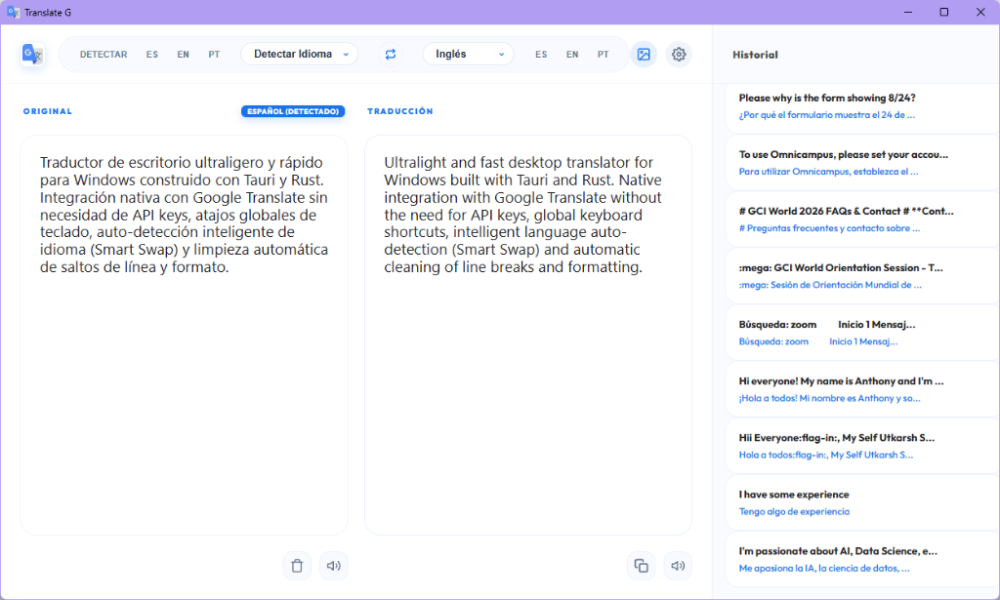
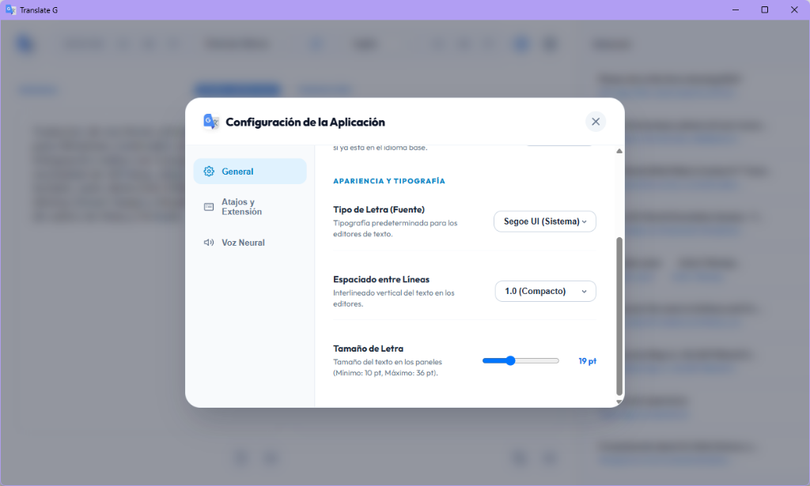

<div align="center">

# Translate-G

**Traductor de escritorio ultraligero al estilo DeepL (`Ctrl + C + C`), potenciado por Rust y Tauri para Windows.**

[](https://github.com/gushf8/Translate-G)
[](https://v2.tauri.app/)
[](https://www.rust-lang.org/)
[](LICENSE)

<p align="center">
  Diseñado para usuarios, investigadores y desarrolladores que requieren traducción instantánea de documentos técnicos, fragmentos de código y texto en pantalla seleccionando cualquier texto y pulsando <b>Ctrl + C + C</b>, sin consumo excesivo de memoria ni depender de API Keys de pago.
</p>

</div>

---

## 📸 Vista Previa de la Aplicación

<div align="center">
  
  <p><em>Figura 1: Interfaz principal con traducción en tiempo real, Smart Swap de idiomas y panel lateral de historial.</em></p>
  <br/>
  
  <p><em>Figura 2: Modal de configuración con personalización tipográfica, espaciado, atajos globales y voz neural.</em></p>
</div>

---

## ⚡ Aspectos Destacados

* **Flujo Instantáneo al estilo DeepL (Doble `Ctrl + C`)**: Selecciona cualquier texto en un navegador, PDF, Word o terminal y presiona **Ctrl + C + C** para abrir la ventana flotante y traducir al instante sin interrumpir tu flujo de trabajo.
* **Smart Paragraph & Soft-Wrap Unification (PDFs y Word)**: Algoritmo avanzado que detecta y desfragmenta automáticamente saltos de línea artificiales generados al copiar desde visores de PDF o documentos Word, unificando los párrafos de manera fluida y continua sin cortes abruptos de oración.
* **Reconstrucción Automática de Guiones de Salto (`-\n`)**: Une automáticamente palabras cortadas al final de línea en documentos PDF (ej. `meto-\ndológico` $\rightarrow$ `metodológico`).
* **Preservación Inteligente de Estructuras**: Respeta estrictamente listas numeradas (`1.`, `2.`, `(a)`), viñetas (`•`, `-`, `*`), etiquetas de diálogo/hablante (`Investigador:`, `Speaker 1:`) y títulos o encabezados independientes.
* **Limpieza de LaTeX y Artefactos de IA**: Convierte notación matemática de LaTeX y KaTeX a Unicode nativo con subíndices/superíndices HTML (`<sub>`, `<sup>`), elimina anotaciones duplicadas generadas por ChatGPT / MathML y repara acentos flotantes o fragmentados de OCR (`dina´mica` $\rightarrow$ `dinámica`).
* **Sanitización Profunda de HTML de Word**: Limpia metadatos y etiquetas propietarias de Microsoft Office (`MsoNormal`, `<o:p>`, estilos incrustados) preservando únicamente negritas, cursivas y saltos de párrafo reales.
* **Sin API Keys**: Conexión directa y eficiente con el motor de Google Translate mediante peticiones ligeras y segmentación inteligente de textos extensos.
* **Smart Language Swap**: Reconocimiento automático bidireccional de idioma de entrada y destino para alternar sin interrupciones.
* **Sincronización Oración por Oración (Sentence Sync & Hover)**: Resaltado visual interactivo y sincronizado de oraciones en tiempo real entre el texto original y la traducción al pasar el cursor o reproducir voz.
* **Voz Neural TTS con Prefetching**: Reproducción de audio de alta fidelidad con voces neurales de Microsoft Edge, cola continua y precarga en segundo plano para pronunciación instantánea sin pausas.
* **Atajos Globales de Windows**: Hook de teclado nativo en Rust de bajísimo consumo que monitorea pulsaciones globales con total fluidez.
* **Consumo Mínimo de Recursos**: Construido sobre Rust y Microsoft WebView2 nativo, garantizando una huella de memoria RAM significativamente inferior frente a alternativas basadas en Electron.

---

## 🏗️ Arquitectura del Sistema

```
Translate-G/
├── src-tauri/             # Núcleo nativo de alta eficiencia en Rust
│   ├── src/translate.rs   # Motor de scraping HTTP optimizado y segmentación de texto
│   ├── src/keyboard.rs    # Registro y captura de atajos globales de Windows
│   └── src/ocr.rs         # Módulo de procesamiento y captura
├── src/                   # Interfaz de usuario desacoplada (HTML5 / Vanilla CSS / JS)
│   ├── modules/           # Módulos de persistencia, sincronización e intercambio inteligente
│   └── styles.css         # Sistema de diseño moderno con soporte de alto contraste
└── docs/                  # Documentación técnica y análisis de viabilidad
```

---

## 🚀 Inicio Rápido

### Prerrequisitos

* [Node.js](https://nodejs.org/) (versión 18 o superior)
* [Rust](https://www.rust-lang.org/) con la cadena de herramientas MSVC (`x86_64-pc-windows-msvc`)

### Instalación y Ejecución

```bash
# 1. Clonar el repositorio
git clone https://github.com/gushf8/Translate-G.git
cd Translate-G

# 2. Instalar dependencias del frontend
npm install

# 3. Iniciar en entorno de desarrollo
npm run tauri dev
```

### Generación del Instalador (.exe / .msi)

```bash
npm run tauri build
```

El instalador optimizado se generará en `src-tauri/target/release/bundle/`.

---

## 📄 Licencia

Distribuido bajo los términos de la **Licencia MIT**. Consulte el archivo [LICENSE](LICENSE) para conocer los términos completos de uso y distribución.

**Autor:** [Gustavo Fernando Huaman Fernandez](https://github.com/gushf8)  
**Filiación:** Universidad Nacional de Huancavelica (UNH)
