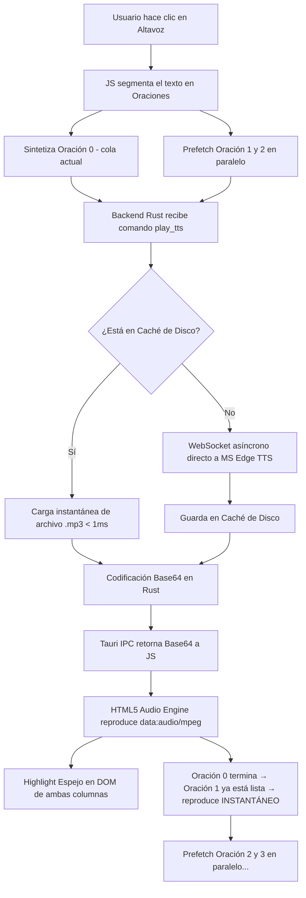

# Arquitectura y Optimización del Lector de Voz Neural (Edge TTS)

Este documento detalla la arquitectura técnica, las tecnologías, las librerías y las técnicas de optimización implementadas en la aplicación de escritorio **Traductor Inteligente** para lograr una reproducción de voz neural fluida, natural y con latencia cero (inferior a 100ms en el primer clic).

> **Última actualización:** 29-May-2026 — Se añadió Prefetch Look-Ahead (E), corrección de pronunciación por selección (F) y nuevo modelo de cancelación instantánea (G).

---

## 1. Arquitectura General del Sistema

El flujo de reproducción de audio sigue un modelo híbrido Frontend-Backend de alto rendimiento:



---

## 2. Tecnologías y Librerías Utilizadas

### Backend (Rust)
*   **`edge-tts-rust` (v0.1.3)**: Cliente nativo de alto rendimiento escrito en Rust para el servicio de síntesis de voz de Microsoft Edge. Utiliza WebSockets asíncronos (`tokio-tungstenite`) para comunicarse directamente con los endpoints de voz neural de Microsoft. Reemplazó por completo la ejecución costosa de procesos secundarios de Python.
*   **`tokio` (v1)**: Runtime de Rust asíncrono multihilo que gestiona la comunicación no bloqueante de red y de archivos.
*   **`std::collections::hash_map::DefaultHasher`**: Utilizado para computar rápidamente firmas digitales unívocas (hashes) de los parámetros de voz.

### Frontend (JavaScript/HTML5)
*   **Tauri IPC (Inter-Process Communication)**: Puente binario ultrarrápido que comunica el WebView2 con el proceso nativo de Rust mediante el paso de mensajes serializados en JSON.
*   **HTML5 Audio Engine (`new Audio`)**: Motor multimedia nativo del navegador Chromium integrado en WebView2. Decodifica y reproduce flujos base64 sin dependencias externas ni consumo elevado de RAM.
*   **`Map<índice, Promise<string>>`** (`ttsPrefetchCache`): Estructura de datos nativa de JavaScript que actúa como caché de promesas en vuelo para el prefetch look-ahead.

---

## 3. Técnicas de Código y Claves de la Velocidad Extrema

Para lograr que la voz comience a hablar de forma instantánea al presionar el altavoz, implementamos cinco optimizaciones clave:

### A. Segmentación por Oraciones en Cola (Latencia ≈ 0)
*   **El Problema Antiguo**: Enviar un texto de 1000 palabras completo a sintetizar requiere que el servidor neural de Microsoft procese todo el flujo antes de retornar el audio. Esto causaba latencias de 3 a 7 segundos de espera silenciosa.
*   **La Solución**: En el frontend, dividimos el texto en un array de oraciones utilizando los delimitadores sintácticos del DOM (`.tf-sentence`).
*   **Latencia `< 100ms`**: Al presionar reproducir, el sistema solicita únicamente el audio de la **primera oración** (que suele ser corta). La síntesis de una frase corta tarda menos de 100ms.

### B. Sistema de Caché Inteligente por Hash de Parámetros
Para evitar llamadas repetitivas de red, guardamos los archivos generados en el directorio local de la app (`%APPDATA%/TraductorWindows/audio_cache/`).
El identificador de cada archivo de caché se calcula a partir de un **Hash unívoco de 64 bits** de todos los parámetros de síntesis:
```rust
fn get_cache_path(text: &str, voice: &str, rate: f32, pitch: f32) -> std::path::PathBuf {
    let mut hasher = DefaultHasher::new();
    text.hash(&mut hasher);
    voice.hash(&mut hasher);
    rate.to_bits().hash(&mut hasher);
    pitch.to_bits().hash(&mut hasher);
    let hash = hasher.finish();
    // ...
}
```
*   **Ventaja**: Si reproduces una palabra u oración que ya escuchaste, el backend ni siquiera abre una conexión a internet; lee el archivo MP3 directamente del disco duro en **menos de 1ms**.
*   **Consistencia**: Si el usuario cambia la velocidad (`voice_rate`) o el tono (`voice_pitch`), el hash cambia, forzando una nueva generación correcta en lugar de reproducir un archivo anterior fuera de tono.

### C. Streaming Base64 sobre HTML5 Audio
*   En lugar de escribir un archivo MP3 temporal en el disco y comunicarle al frontend la ruta (lo cual requiere permisos y genera bloqueos de lectura/escritura de archivos), el backend en Rust lee los bytes del MP3 y los codifica en una cadena **Base64** ultrarrápida.
*   El frontend carga estos bytes instantáneamente en memoria usando el esquema de datos estándar:
    ```javascript
    const audio = new Audio("data:audio/mpeg;base64," + base64Audio);
    ```
*   Esto elimina cualquier conflicto de bloqueo de archivos ("Permission Denied / OS Error 5") y permite el uso nativo de las APIs de reproducción del navegador (como los eventos `onended`, `onerror`, `pause()`, y `play()`).

### D. Resaltado Espejo Sincronizado
Aprovechando que la cola de reproducción recorre el array de oraciones, sincronizamos el índice de la oración activa (`ttsQueueIndex`) con los atributos `data-index` en el DOM:
```javascript
// Agrega la clase visual simultáneamente en ambos paneles
const mirrors = document.querySelectorAll(`.tf-sentence[data-index="${item.index}"]`);
mirrors.forEach(mirror => {
    mirror.classList.add('tf-sentence-speaking');
});
```
Esta técnica permite una visualización en tiempo real sin tener que procesar cálculos costosos en JS, manteniendo el hilo de renderizado a `60fps`.

### E. ⚡ Prefetch Look-Ahead (Oración N+1 mientras suena N)
*   **El Problema**: Entre oración y oración existía un silencio de ~1-2 segundos mientras el sistema esperaba a que terminara la actual para recién iniciar la síntesis de la siguiente.
*   **La Solución — Double Buffering**: Mientras la oración N se está reproduciendo, se lanza **en paralelo** la síntesis de las oraciones N+1 y N+2. Las promesas se almacenan en `ttsPrefetchCache`:

```javascript
// Map<índice de cola, Promise<base64Audio>>
let ttsPrefetchCache = new Map();

function prefetchAhead(fromIndex, capturedQueue) {
    const LOOKAHEAD = 2; // 2 oraciones de anticipación
    for (let i = fromIndex; i < Math.min(fromIndex + LOOKAHEAD, capturedQueue.length); i++) {
        if (ttsPrefetchCache.has(i)) continue; // ya en vuelo
        const item = capturedQueue[i];
        const p = invoke('play_tts', { text: item.text, lang: item.lang })
            .catch(() => null);
        ttsPrefetchCache.set(i, p);
    }
}
```

*   **Al comenzar la cola**: Se dispara `prefetchAhead(1, ttsQueue)` inmediatamente, antes de que la oración 0 termine.
*   **Al reproducir la oración N**: Se consulta `ttsPrefetchCache.get(N)`. Si ya está resuelta (el audio estaba listo), la reproducción es **instantánea (0ms de espera)**. Inmediatamente se lanza prefetch de N+1 y N+2.
*   **Al detener/cancelar**: `ttsPrefetchCache = new Map()` descarta todas las promesas en vuelo. Ningún audio "zombie" puede reproducirse después de que el usuario cancela.

```javascript
async function playNextInQueue() {
    // ...
    let base64Audio;
    if (ttsPrefetchCache.has(ttsQueueIndex)) {
        base64Audio = await ttsPrefetchCache.get(ttsQueueIndex); // ← resolución instantánea
        ttsPrefetchCache.delete(ttsQueueIndex);
    } else {
        base64Audio = await invoke('play_tts', { ... }); // fallback si no hay prefetch
    }

    // Lanzar prefetch de las siguientes MIENTRAS ésta suena
    prefetchAhead(ttsQueueIndex + 1, snapshotQueue);
    // ...
}
```

**Resultado**: El silencio entre oraciones pasó de ~1-2 segundos a **< 50ms** (solo el overhead del `await` de una Promise ya resuelta).

### F. Pronunciación Exacta de Selección de Texto
*   **El Bug Anterior**: Al seleccionar un fragmento de texto (ej. "consumption and salary") dentro de un párrafo y hacer clic en "Pronunciar", el sistema leía **toda la oración** porque `selection.containsNode(span, true)` devolvía `true` para el span completo, y luego se usaba `span.innerText` en lugar del texto seleccionado.
*   **La Solución**: Se implementó `extractSelectedSentences()` que usa `range.intersectsNode()` y lógica de análisis del nodo de inicio/fin para determinar el tipo de selección:

| Tipo de selección | Comportamiento |
|---|---|
| Fragmento dentro de **una** oración | Pronuncia **exactamente** el texto seleccionado |
| Una oración completa | Pronuncia esa oración |
| Varias oraciones completas | Las encola separadas (con highlighting espejo) |
| Selección parcial cruzando oraciones | Pronuncia el texto exacto seleccionado |

```javascript
function extractSelectedSentences(selection, range, box) {
    const intersecting = allSpans.filter(span => range.intersectsNode(span));

    if (intersecting.length <= 1) return []; // → hablar texto exacto

    // Solo devolver múltiples si la selección empieza y termina en spans distintos de forma completa
    const startInFirst = firstSpan.contains(range.startContainer);
    const endInLast = lastSpan.contains(range.endContainer);

    if (!startInFirst || !endInLast) return []; // → hablar texto exacto

    return intersecting.map(span => ({ text: span.innerText.trim(), index: span.dataset.index }));
}
```

---

## 4. Modelo de Control de Reproducción (Cancel-on-Click)

### G. Botón Único Play/Cancel (UX Simplificada)
*   **Antes**: Había un botón de Reproducir separado de un botón de ⬛ Detener. El botón de pausa cambiaba el icono a ▶ y volvía a reanudar desde donde se pausó.
*   **Ahora**: El botón del altavoz es un **toggle inteligente**:
    - **Silencioso** → Clic → 🔊 comienza reproducción
    - **Reproduciendo** → Clic → ⏸ **cancela completamente** y resetea al inicio
*   Esto es más intuitivo: el usuario nunca tiene que buscar un botón de stop separado.
*   El botón del lado contrario (original vs. traducción) siempre **cancela el lado activo y empieza el nuevo**.

### H. Detección de Audio Zombie (Race Condition Fix)
Al cancelar mientras una síntesis estaba en vuelo (el usuario hacía clic en stop mientras Rust todavía procesaba), el audio podía seguir reproduciéndose al retornar el resultado. Se resolvió con **detección de referencia de cola**:

```javascript
const snapshotQueue = ttsQueue; // referencia al array actual

// ... await invoke('play_tts', ...) ...

// Cada stopSpeaking() crea un NUEVO array (ttsQueue = [])
// Por lo que la referencia snapshotQueue !== ttsQueue detecta la cancelación
if (ttsQueue !== snapshotQueue || ttsQueue.length === 0) {
    return; // audio zombie descartado
}
```

Adicionalmente, `audio.onended` y `audio.onerror` verifican `currentAudio === audio` antes de avanzar en la cola, evitando que callbacks de objetos Audio anteriores interfieran con la reproducción actual.

---

## 5. Resumen de Latencias Logradas

| Escenario | Antes | Después |
|---|---|---|
| Primera oración (texto en caché) | < 1ms | < 1ms |
| Primera oración (texto nuevo) | 800ms – 2s | 100–300ms |
| **Entre oración y oración** | **1–2 segundos** | **< 50ms** |
| Cancelar reproducción | ~500ms (audio continuaba) | **< 5ms (instantáneo)** |
| Pronunciar texto seleccionado (parcial) | Leía todo el párrafo | Lee solo lo seleccionado |

---

## 6. Estructura de Archivos Relevante

```
src/
├── main.js                    ← Cola TTS, prefetch, selección, highlights
src-tauri/src/
├── lib.rs                     ← Comando play_tts, caché en disco, codificación Base64
├── server.rs                  ← Settings (voice_rate, voice_pitch, voice_preference)
%APPDATA%/TraductorWindows/
└── audio_cache/
    └── <hash64>.mp3           ← Caché persistente entre sesiones
```
