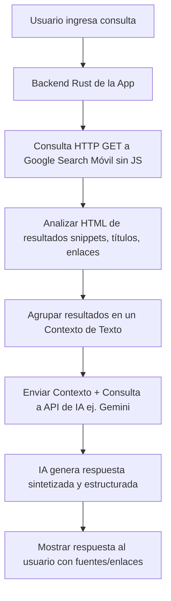

# Funcionamiento Interno de Traducción y Factibilidad de Búsqueda Web con IA

Este documento detalla el mecanismo interno que utiliza la aplicación para enviar textos y recibir traducciones desde Google Translate de forma gratuita y sin claves de API. Asimismo, analiza la viabilidad de replicar este flujo para realizar consultas web automáticas potenciadas con Inteligencia Artificial utilizando el buscador de Google.

---

## 1. Funcionamiento Interno de la Traducción (Scraping de Google Translate)

El backend de la aplicación, implementado en Rust ([translate.rs](file:///c:/Users/gushf/Downloads/Aplicaciones%20con%20IA/Traductor-windows/src-tauri/src/translate.rs)), realiza traducciones directas interactuando con la interfaz móvil simplificada de Google Translate.

### Flujo de Ejecución de la Traducción

```mermaid
graph TD
    A[Frontend JS] -- Texto e Idiomas --> B[Comando Tauri translate_text]
    B --> C[translate.rs - translate()]
    C --> D{¿Texto > 4500 caracteres?}
    D -- Sí --> E[Segmentar en trozos con split_text]
    D -- No --> F[Procesar texto completo]
    E --> G[Codificar texto en formato URL]
    F --> G
    G --> H[Petición HTTP GET con Mobile User-Agent]
    H --> I[Recibir HTML Móvil Simplificado]
    I --> J[Análisis Manual del HTML regex_find]
    J --> K[Extracción del resultado class='result-container']
    J --> L[Detección de idioma de entrada name='sl']
    K --> M[Limpieza de entidades HTML y Saltos de Línea]
    L --> N[Retornar Traducción e Idioma Detectado al Frontend]
    M --> N
```

### Componentes Clave del Flujo

1. **Uso de Interfaz Móvil y User-Agent Específico**:
   El cliente HTTP (`reqwest::Client`) se configura con un `User-Agent` de dispositivo móvil:
   ```rust
   "Mozilla/5.0 (Linux; Android 10; K) AppleWebKit/537.36 (KHTML, like Gecko) Chrome/114.0.0.0 Mobile Safari/537.36"
   ```
   **Por qué es clave**: Al simular un navegador móvil antiguo, Google Translate no retorna la versión pesada en React/JavaScript, sino un archivo HTML estático e interactivo básico muy ligero. Esto elimina la necesidad de renderizar JavaScript y permite recibir la traducción directamente en la respuesta HTTP pura.

2. **Endpoint de Consulta**:
   Se realiza una petición `GET` a la dirección:
   ```
   https://translate.google.com/m?sl={sl}&tl={tl}&q={texto_codificado}
   ```
   Donde `sl` es el idioma origen (ej. `auto`), `tl` el de destino (ej. `es`) y `q` el texto codificado en formato URL.

3. **Segmentación de Textos Largos (`split_text`)**:
   Google Translate limita las consultas a un máximo aproximado de 5000 caracteres por petición. La función `split_text` fragmenta de forma inteligente los textos mayores a 4500 caracteres respetando los saltos de línea dobles (`\n\n`), sencillos (`\n`), puntos finales e interrogaciones (`.`, `!`, `?`) y espacios, evitando cortar palabras por la mitad.

4. **Análisis de HTML sin Librerías Externas (`regex_find`)**:
   Para mantener los tiempos de compilación y el tamaño del binario al mínimo, no se usa un analizador HTML (parser) completo. En su lugar, se busca texto manualmente a través de la función `regex_find`:
   - **Contenedor del resultado**: Se busca la clase `class="result-container"`, se extrae el texto interno y se limpian las etiquetas `<br>` y las entidades HTML básicas (`&quot;`, `&amp;`, `&#39;`, etc.).
   - **Idioma Detectado**: Si se especificó `sl="auto"`, se localiza el elemento de formulario oculto `<input name="sl" value="...">` para saber qué idioma de origen detectó Google.

---

## 2. Factibilidad de Búsqueda Web con IA utilizando este Flujo

La pregunta clave es: **¿Podemos implementar este mismo flujo (petición HTTP móvil + extracción de HTML) para hacer búsquedas web en Google y procesarlas con IA?**

**Respuesta breve**: Sí, es técnicamente posible realizar la consulta y extraer los datos. Sin embargo, Google Search tiene medidas de seguridad y estructuras mucho más complejas que Google Translate, por lo que requiere adaptaciones.

### Flujo Propuesto de Búsqueda Web con IA



### Cómo funcionaría técnicamente el "Scraping" de Búsqueda

1. **Parámetro para Desactivar JavaScript**:
   Google permite obtener una versión HTML estática sin JavaScript (ideal para dispositivos antiguos o scripts rápidos) agregando el parámetro `gbv=1` a la URL.
   - **URL de consulta**: `https://www.google.com/search?q={consulta_codificada}&gbv=1`

2. **Estructura a extraer del HTML**:
   En la versión móvil sin JavaScript, los resultados orgánicos están contenidos en contenedores con clases genéricas o etiquetas específicas (como estructuras dentro de tablas o divs de clase `ZINbbc`). Se pueden extraer:
   - Los **Títulos** (etiquetas `<h3>` o etiquetas de enlace `<a>`).
   - Las **URLs de origen** (limpiando los redireccionamientos de Google de tipo `/url?q=...`).
   - Los **Resúmenes (snippets)** (usualmente el texto plano dentro del div contenedor).

---

## 3. Retos Técnicos y Limitaciones de Seguridad

A diferencia de Google Translate, Google Search protege sus datos de búsqueda de manera muy estricta debido al spam de SEO y bots de scraping.

### 1. CAPTCHAs y Bloqueos de IP (HTTP 429 Too Many Requests)
Si el backend realiza consultas muy frecuentes desde la misma dirección IP sin una sesión interactiva (cookies, historial de navegación normal), Google detectará el tráfico como "inusual" y responderá con un **CAPTCHA de Google** en lugar del HTML de resultados.
- *Frecuencia*: En Translate el límite de uso sin bloqueo es bastante amplio. En Search, los bloqueos pueden ocurrir tras unas pocas decenas de consultas rápidas.

### 2. Fragilidad del HTML de Search
El diseño y las clases CSS del HTML de búsqueda móvil cambian con frecuencia. Si Google actualiza el nombre de los contenedores o el orden de las etiquetas, la extracción basada en cadenas de texto (`find` o expresiones regulares sencillas) dejará de funcionar y requerirá actualizar el código de la aplicación.

---

## 4. Alternativas Recomendadas para una Implementación Robusta

Para lograr una funcionalidad estable de **Búsqueda Web con IA** en la aplicación, se sugieren las siguientes alternativas ordenadas por confiabilidad:

### Opción A: Google Custom Search JSON API (Oficial y Gratuita)
Google ofrece un servicio oficial de búsqueda que devuelve los resultados directamente en formato JSON.
- **Ventajas**: Es 100% estable, no se rompe si cambia el HTML y nunca activará CAPTCHAs.
- **Coste**: Ofrece **100 búsquedas al día gratis**, lo cual es excelente para uso personal. Si se requiere más, cuesta $5 por cada 1000 consultas.
- **Flujo**:
  1. Rust hace un request a: `https://www.googleapis.com/customsearch/v1?key={API_KEY}&cx={SEARCH_ENGINE_ID}&q={consulta}`
  2. Lee el JSON directamente (sin parsear HTML complejo).
  3. Pasa los snippets al modelo de IA para generar la respuesta.

### Opción B: DuckDuckGo HTML Scraping (Menos Restricciones)
DuckDuckGo tiene una versión HTML simplificada (`https://html.duckduckgo.com/html/?q={consulta}`) que es mucho más amigable con el raspado de datos.
- **Ventajas**: DuckDuckGo no aplica bloqueos tan agresivos como Google, no muestra CAPTCHAs molestos en el tráfico automatizado habitual, y su HTML es mucho más fácil de estructurar y parsear estáticamente.

### Opción C: Integrar APIs de Búsqueda para IA (ej. Tavily o SearXNG)
Existen servicios diseñados específicamente para proveer resultados de búsqueda optimizados para alimentar LLMs (Modelos de Lenguaje).
- **Tavily API**: Devuelve el contenido limpio y filtrado de las webs relevantes para que la IA lo asimile directamente.
- **SearXNG**: Es un metabuscador de código abierto que puedes alojar de forma gratuita y realiza las consultas a múltiples motores (Google, Bing, Yahoo) de forma anónima, exponiendo un endpoint JSON limpio para tu aplicación.
